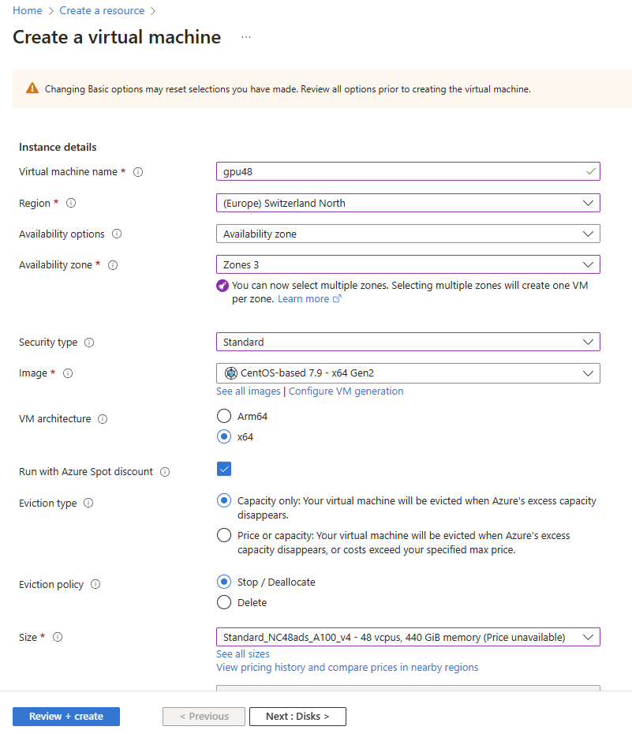
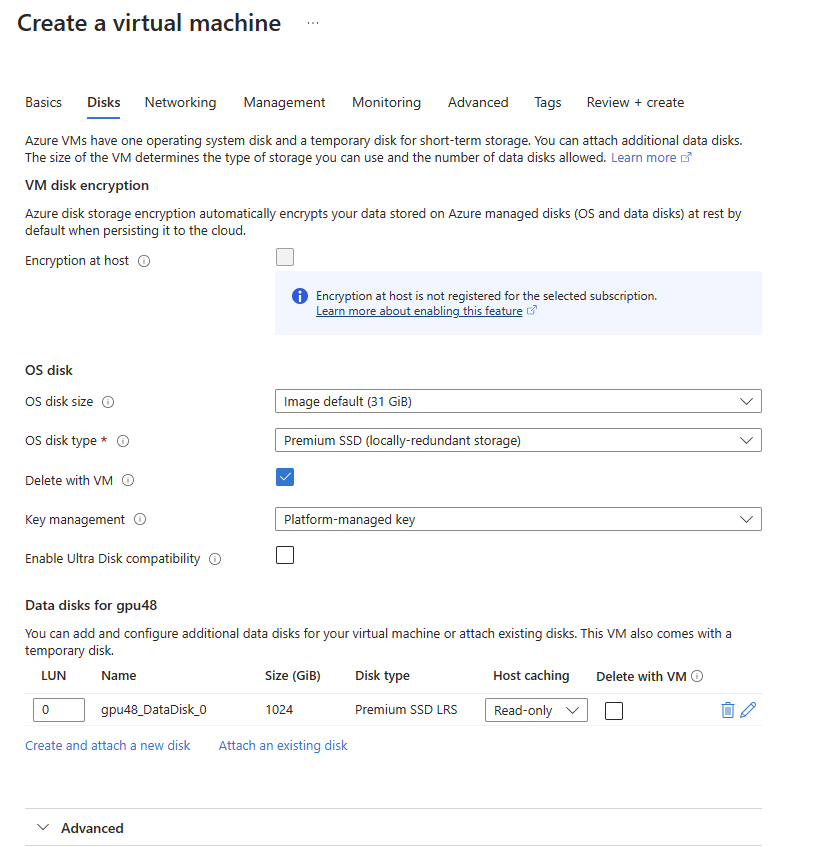
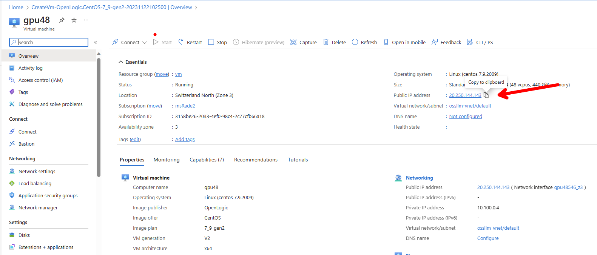
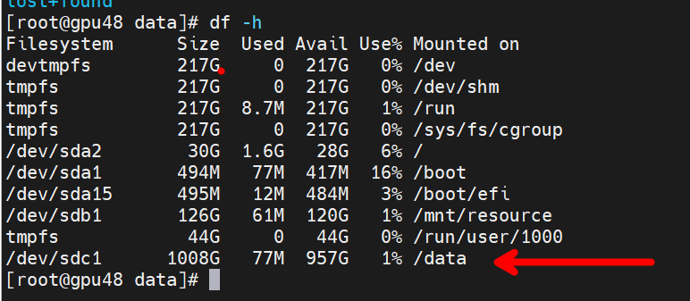
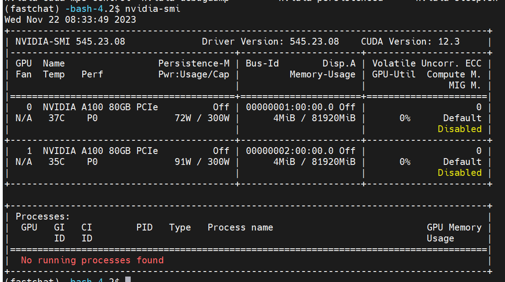

# 在Azure上部署开源模型

开源LLM模型发展和迭代很快，尤其是在国内。本文介绍如何在Azure上部署开源模型，如ChatGLM, LLAMA 2等等。可以直接部署，也可以使用开源工具，如FastChat, DB-GPT等。本文以ChatGLM/FastChat/DB-GPT为例，介绍如何在Azure上部署开源模型。

## 直接部署ChatGLM3-6B
[ChatGLM3-6B On Azure 部署指南](./chatglm3.md)

## 使用FastChat来部署各种开源模型
[使用FastChat来部署开源模型on Azure](./fastchat.md)

<hr/>
在部署之前，需要先准备好Azure环境。如下使用Azure VM CentOS 7.9 作为例子，介绍如何准备环境。

## 环境准备
1. 创建Azure VM
最好使用GPU机型，如Standard NC24ads A100 v4。如果想尝试多个模型，建议用1TB以上的硬盘，因为模型文件很大。



2. ssh登录到VM, 挂载 data盘
```bash
sudo -i

fdisk -l
fdisk /dev/sdc
# n, p, 1, enter, enter, w
mkfs -t ext4 /dev/sdc1

mkdir /data

echo "/dev/sdc1 /data ext4 defaults 0 0" >> /etc/fstab

mount -a

chown -R myadmin:myadmin /data

df -h
```


3. 将home(/home/myadmin)目录移到/data
```bash
su myadmin

cd /data
sudo mv /home/myadmin /data/myadmin
sudo ln -s /data/myadmin /home/myadmin
```
4. 安装anaconda, git
```bash
mkdir /data/conda
cd /data/conda
wget https://repo.anaconda.com/archive/Anaconda3-2023.09-0-Linux-x86_64.sh
bash Anaconda3-2023.09-0-Linux-x86_64.sh
# 回车，空格..yes, 一路回车

# 安装完成后
cd /home/myadmin/anaconda3/bin
./conda init
source ~/.bashrc

# 安装git
sudo yum -y install https://packages.endpointdev.com/rhel/7/os/x86_64/endpoint-repo.x86_64.rpm
sudo yum install git -y
curl -s https://packagecloud.io/install/repositories/github/git-lfs/script.rpm.sh | sudo bash
sudo yum install git-lfs -y


```
5. GPU环境准备 (如果是GPU机型)
```bash
lspci | grep -i nvidia
# 如果没有输出，需要安装NVIDIA A100驱动
# https://learn.microsoft.com/zh-cn/azure/virtual-machines/linux/n-series-driver-setup

# 安装完成后，重启虚机，运行下面命令，确认驱动安装成功
nvidia-smi
```



