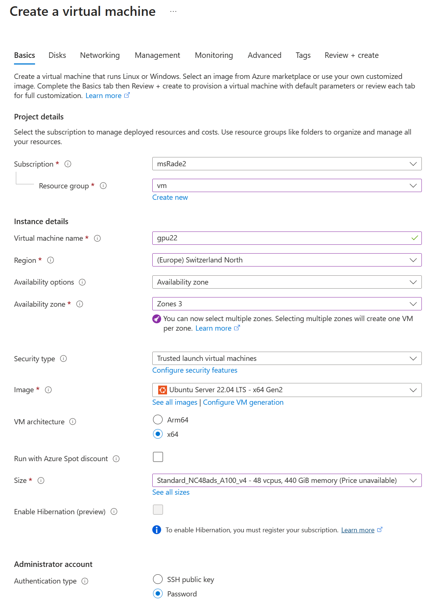
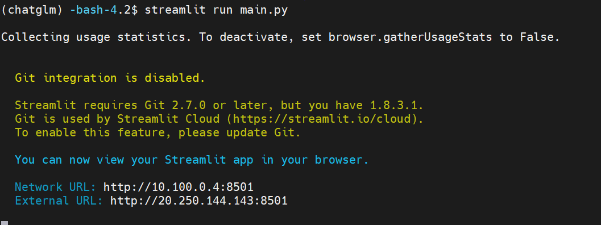
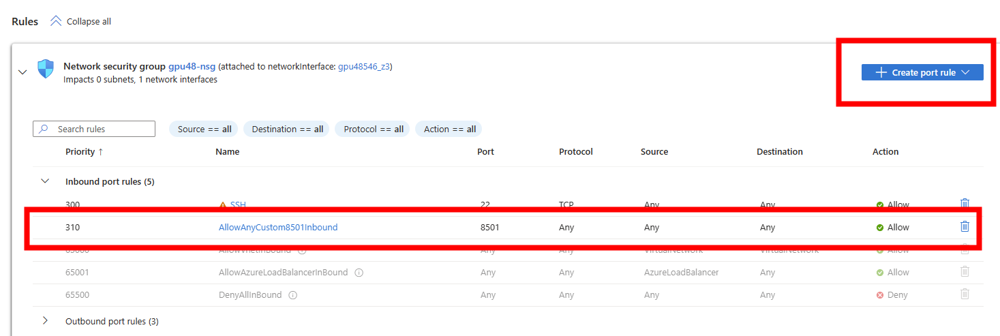
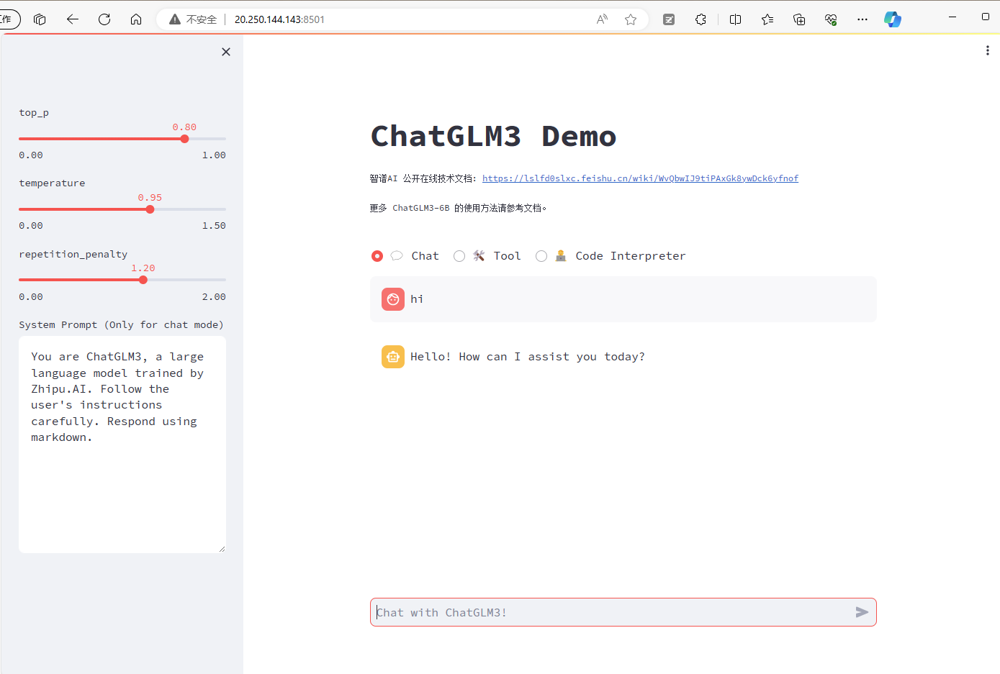

# 在Azure上部署开源模型

开源LLM模型发展和迭代很快，尤其是在国内。本文介绍如何在Azure上部署开源模型，如ChatGLM, LLAMA 2等等。可以直接部署，也可以使用开源工具，如FastChat, DB-GPT等。本文以ChatGLM为例，介绍如何在Azure上部署开源模型。

## 环境准备
1. 创建Azure VM
最好使用GPU机型，如Standard NC24ads A100 v4。如果想尝试多个模型，建议用1TB以上的硬盘，因为模型文件很大。



2. ssh登录到VM, 挂载 data盘
```bash
sudo -i

fdisk -l
fdisk /dev/sdc
# n, p, 1, enter, enter, w
mkfs -t ext4 /dev/sdc1

mkdir /data

echo "/dev/sdc1 /data ext4 defaults 0 0" >> /etc/fstab

mount -a

chown -R myadmin:myadmin /data

df -h
```


3. 将home(/home/myadmin)目录移到/data
```bash
su myadmin

cd /data
sudo mv /home/myadmin /data/myadmin
sudo ln -s /data/myadmin /home/myadmin
```
4. 安装anaconda, git
```bash
mkdir /data/conda
cd /data/conda
wget https://repo.anaconda.com/archive/Anaconda3-2023.09-0-Linux-x86_64.sh
bash Anaconda3-2023.09-0-Linux-x86_64.sh
# 一路回车

# 安装完成后
cd /home/myadmin/anaconda3/bin
./conda init
source ~/.bashrc

# 安装git
sudo yum install git -y
curl -s https://packagecloud.io/install/repositories/github/git-lfs/script.rpm.sh | sudo bash
sudo yum install git-lfs -y


```

## 部署ChatGLM
1. 准备chatglm环境
```bash
conda create -n chatglm python=3.10 -y
conda activate chatglm
```
2. 下载ChatGLM代码
```bash
cd ~
git clone https://github.com/THUDM/ChatGLM3
cd ChatGLM3
pip install -r requirements.txt

```
3. 下载模型文件
```bash
cd basic_demo
python cli_demo.py
```
第一次运行会下载模型文件，模型文件很大，需要等待一段时间。Azure的网速很快，大概需要1分钟左右。


4. 启动Web服务
```bash
pip install jupyter_client
cd composite_demo
streamlit run main.py
```

在虚机的NSG中，打开8501端口，就可以在浏览器中访问了。



如果需要后台运行，可以使用nohup
```bash
nohup streamlit run main.py &
```

其他的使用方法，可以参考:
https://github.com/THUDM/ChatGLM3/blob/main/composite_demo/README.md