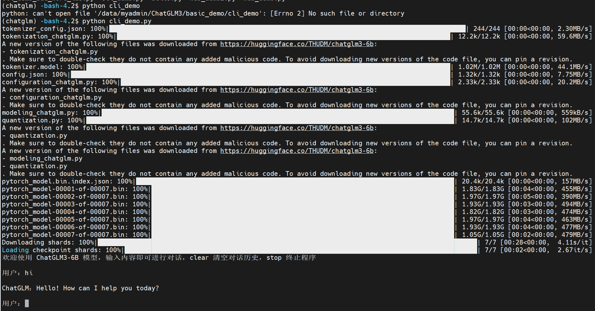
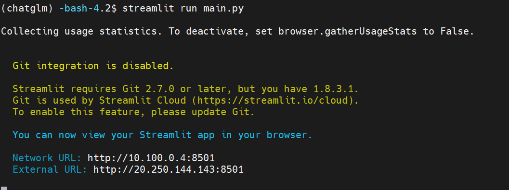
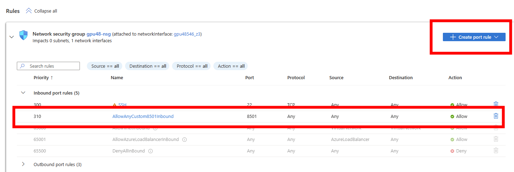

# ChatGLM3-6B On Azure 部署指南   
ChatGLM3 是智谱AI和清华大学 KEG 实验室联合发布的新一代对话预训练模型。ChatGLM3-6B 是 ChatGLM3 系列中的开源模型，在保留了前两代模型对话流畅、部署门槛低等众多优秀特性的基础上，进一步提升了模型的对话质量。本文介绍如何在Azure上部署ChatGLM3-6B模型。<br/>
参考:
https://github.com/THUDM/ChatGLM3
## 环境准备
参考[在Azure上部署开源模型](./README.md#环境准备)的环境准备部分。

## 部署ChatGLM3-6B
1. 准备chatglm环境
```bash
conda create -n chatglm python=3.10 -y
conda activate chatglm
```
2. 下载ChatGLM代码
```bash
cd ~
git clone https://github.com/THUDM/ChatGLM3
cd ChatGLM3
pip install -r requirements.txt

```
3. 下载模型文件
```bash
cd basic_demo
python cli_demo.py
```
第一次运行会下载模型文件，模型文件很大，需要等待一段时间。Azure的网速很快，大概需要5分钟左右。


4. 启动Web服务
```bash
pip install jupyter_client
cd ~/ChatGLM3
cd composite_demo
streamlit run main.py
```

在虚机的NSG中，打开8501端口，就可以在浏览器中访问了。



如果需要后台运行，可以使用nohup
```bash
nohup streamlit run main.py 2>&1 &
```

其他的使用方法，可以参考:
https://github.com/THUDM/ChatGLM3/blob/main/composite_demo/README.md