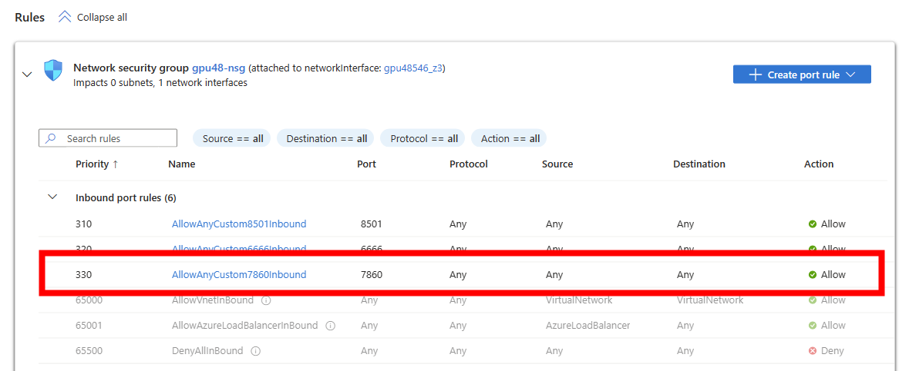
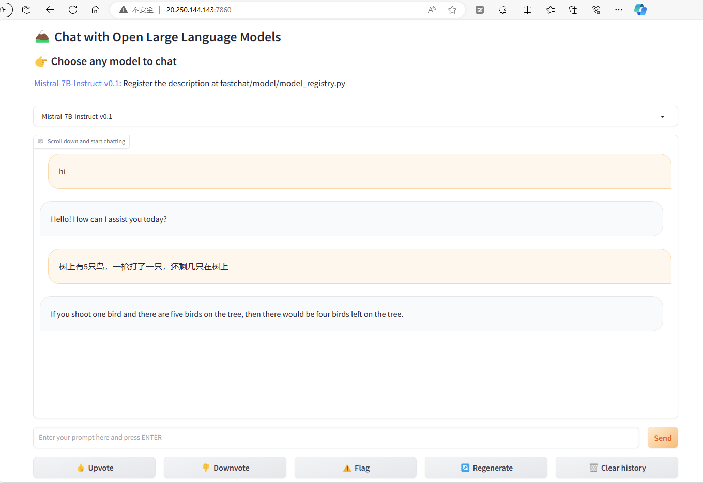
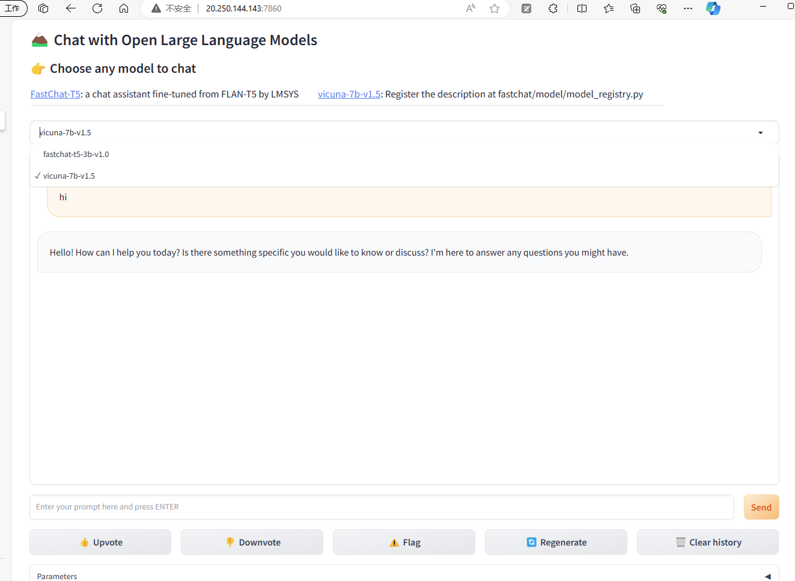

# 使用FastChat来部署开源模型on Azure

FastChat 是一个开源的基于大语言模型的聊天机器人训练、服务、评估平台。可以使用它来快速部署各种huggingface里的开源模型，如vicuna-7b-v1.5,Mistral-7B-Instruct-v0.1等等。本文介绍如何使用FastChat来部署开源模型。
- 支持的模型参考
https://github.com/lm-sys/FastChat/blob/main/docs/model_support.md

## 环境准备
参考[在Azure上部署开源模型](./README.md#环境准备)的环境准备部分。

## 部署FastChat
1. 准备fastchat环境
```bash
conda create -n fastchat python=3.10 -y
conda activate fastchat
```
2. 下载FastChat代码
```bash
cd ~
git clone https://github.com/lm-sys/FastChat
cd FastChat

#init
pip3 install "fschat[model_worker,webui]"
```
3.启动FastChat服务
- 启动Controller
```bash
python3 -m fastchat.serve.controller

#后台运行:
# nohup python3 -m fastchat.serve.controller > ctrl.log 2>&1 &

```
- 启动ModelWorker, 第一次运行的模型会自动下载
```bash
python3 -m fastchat.serve.model_worker --model-path mistralai/Mistral-7B-Instruct-v0.1 

#如果是cpu环境，需要加上 --device cpu
```

- 启动WebUI
```bash
python3 -m fastchat.serve.gradio_web_server

#后台运行:
# nohup python3 -m fastchat.serve.gradio_web_server > web.log 2>&1 &
```
4. 在浏览器中访问
- 添加NSG, 默认端口是7860

- 在浏览器中访问


## 同时运行多个模型
FastChat支持同时运行多个模型，打开不同的terminal, 需要在启动ModelWorker时，指定不同的端口即可。
```bash
# worker 0
CUDA_VISIBLE_DEVICES=0 python3 -m fastchat.serve.model_worker --model-path lmsys/vicuna-7b-v1.5 --controller http://localhost:21001 --port 31000 --worker http://localhost:31000
# worker 1
CUDA_VISIBLE_DEVICES=1 python3 -m fastchat.serve.model_worker --model-path lmsys/fastchat-t5-3b-v1.0 --controller http://localhost:21001 --port 31001 --worker http://localhost:31001

```

